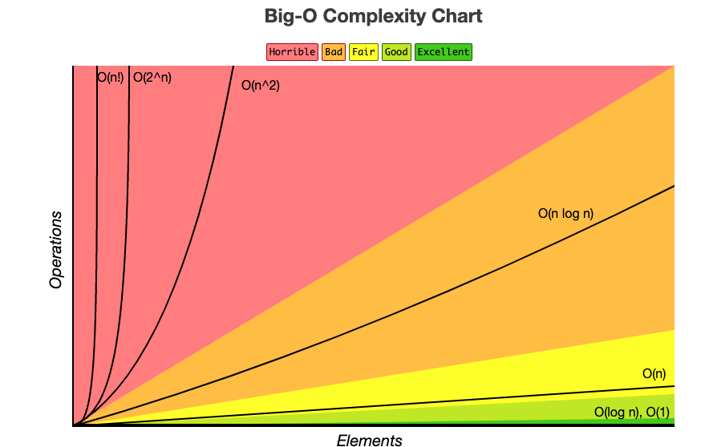

### Big O

* Ω - for best case
* θ - for average case
* O - for worst case
* Most of the focus is to avoid worst case complexity
* O(n^2) - nested loops
* O(n) - single loop
* O(logn) - divide and conquer techniques
* O(1) - single operation (addition)
* O(nlogn) - some sorting algorithms
* O(m*n) - 2 for loops with a and b iterations

### Complexity Chart

### 2D Arrays

* a[i][j] - i is row and j is column
*  Traversing or Searching is `O(m*n)`, other operations are `O(1)` mostly

