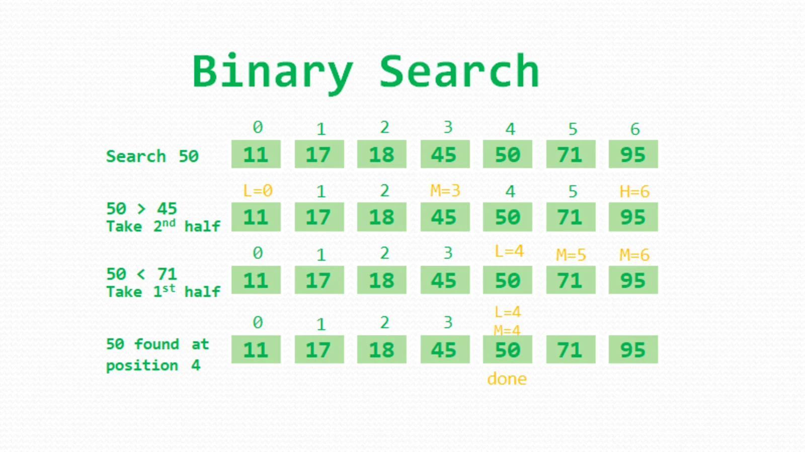

### Binary Search

* Divide the given sorted array to half until the target number is found
*  
* Time complexity: O(logn)
* create 2 pointers low and high
* low = 0, high = numbers.length-1
* calculate the middle position (low+high) / 2
* check if the middle is the number to find
  * else if the number to find is less the middlenumber
    * then set high=middlePosition - 1
  * else if the number to find is greater than the middleNumber
    * then set low=middlePosition + 1
  * iterate the above until the number is found

### For recursive method,
* use the same steps above

